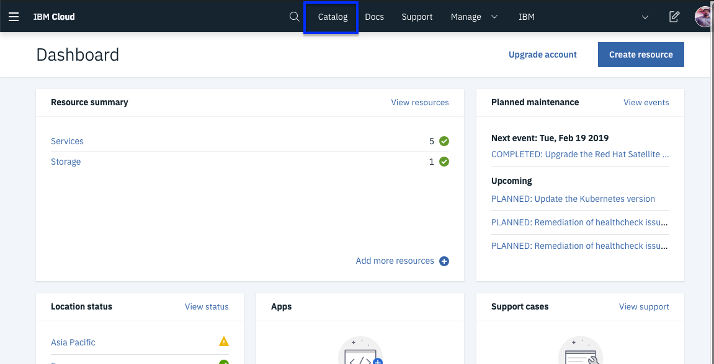
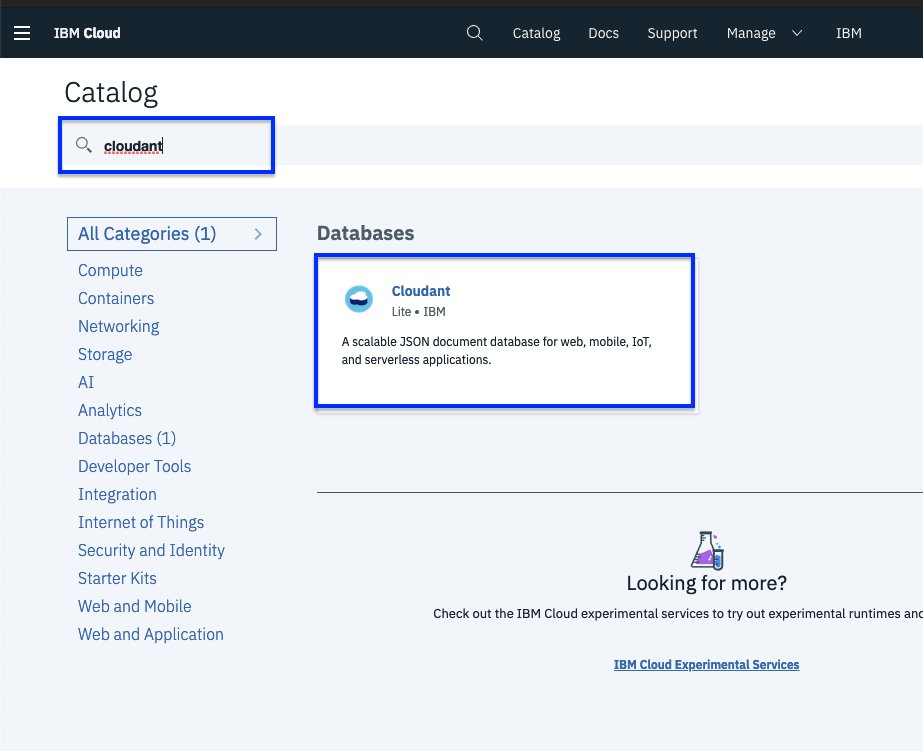
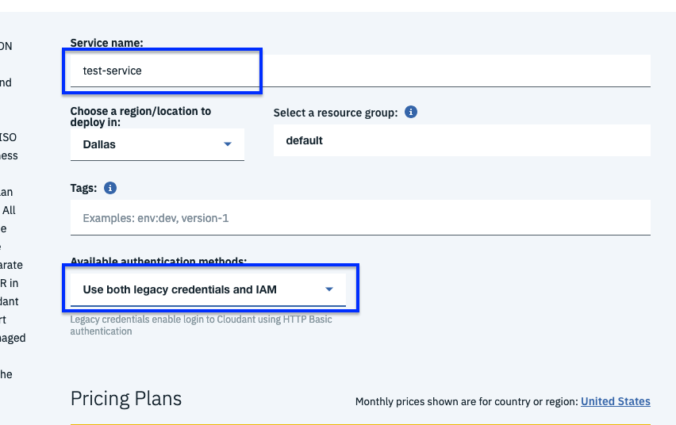
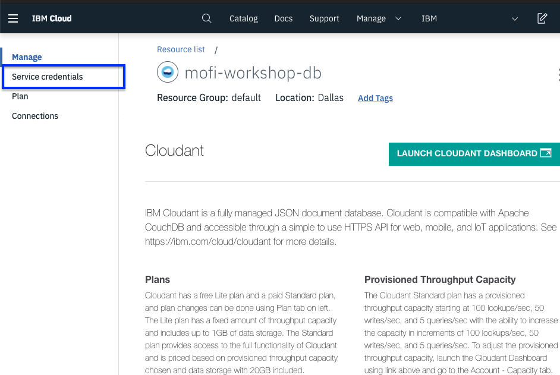
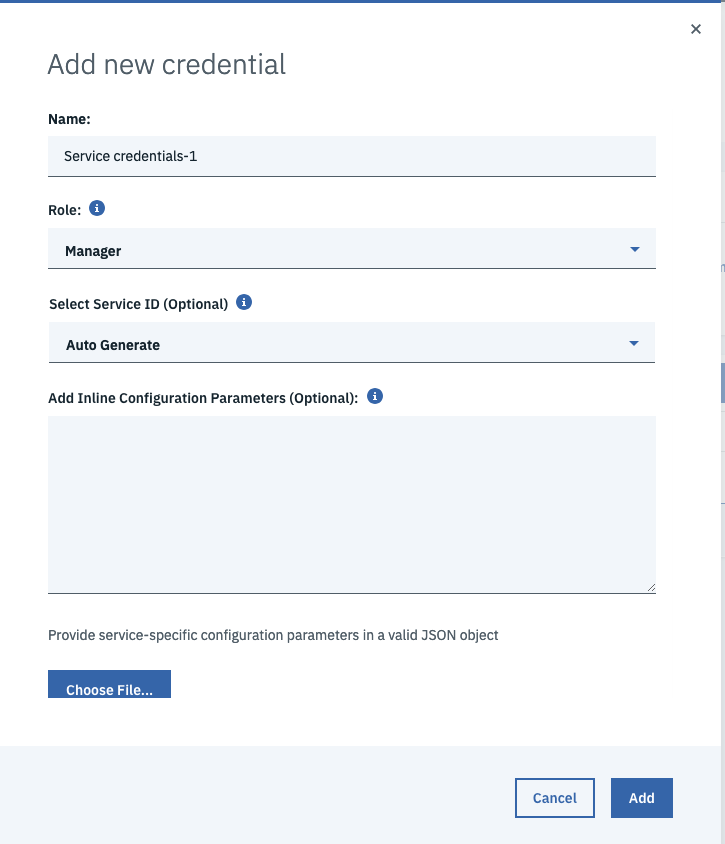
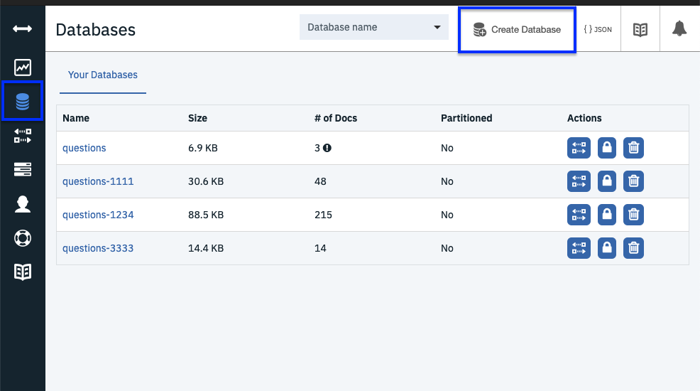

# Cloudant Database

In this step we will create a lite cloudant database.

1. Log into [IBM Cloud Account](https://cloud.ibm.com) 
2. Go to catalog in the top nav bar.

3. Search for cloudant in the text box.

4. Select Cloudant from the result.

5. Select a name for the service and for **authentication methods** select `Use both legacy credentials and IAM`

6. Once the db is loaded go to service credential. You can always come back to this page from your account dashboard.

7. Click on `New Credentials` . Give the credentials a name for **Select Service Id** use `Auto Generate` . Click Add.

8. Once its generated click on **view credentials** to take a look at it. We will need the `username` and `password` at a later step.

9. Go Back to **Manage** on the left hand side. Click on `Launch Cloudant Dashboard` Once it loads. On the left hand side click on `Databases` and then click on `Create Database` on the top nav bar.

10. Name the database `questions` Just like the database I already have. The reason we are doing this is when we create a question we would put it in here. And I did not want to check for database existing every-time when the function ran. This will make more sense when we look at the function. For now just take my word for it. It's also a place to view your data. If you ever need to look closely at your data this is where you will do so.

