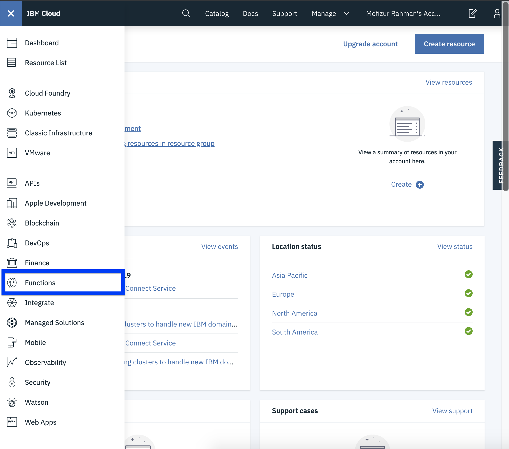
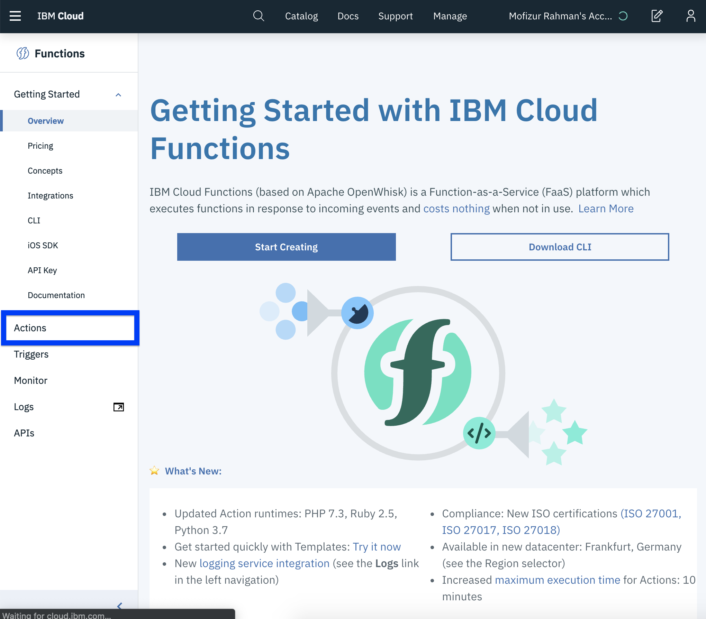
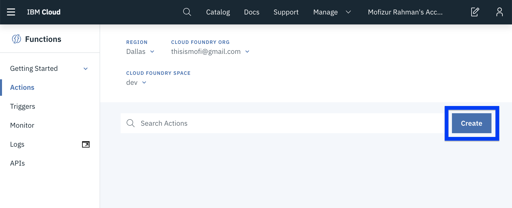
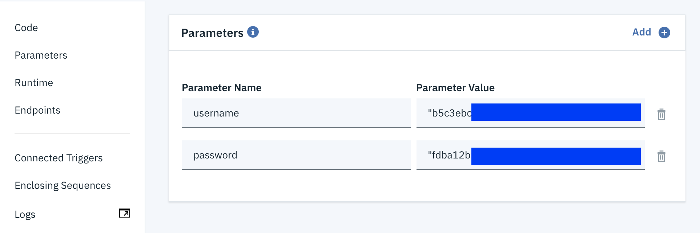
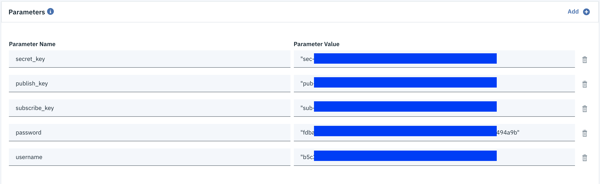

# Create the Functions

In this section we will create our function. We will see how to create function using both the web ui and cli.

## From the Web UI

* Log into[ IBM Cloud](https://cloud.ibm.com)
* Click the top left hamburger.


* Select functions



* Go to actions



* Click on Create 



* Click on Create Actions


* Give the action a name. For out first action we will create `create question` action. We will also put this action in a package called. Package helps us organize our functions. For runtime select Node.js 10



First time you would have to create package to get the package. For any other time, you can find the workshop package in the dropdown


* Click on Create
* This would take us to the editor. 

```javascript
/**
  *
  * main() will be run when you invoke this action
  *
  * @param Cloud Functions actions accept a single parameter, which must be a JSON object.
  *
  * @return The output of this action, which must be a JSON object.
  *
  */
function main(params) {
	return { message: 'Hello World' };
}

```

* We can invoke this action by clicking the Invoke button. 
* We can also change input to pass in a params.
* We can set default parameters from `Parameters` tab on the left.
* From the cloned folder, go to the functions directory.

```bash
cd functions
```

* All five functions are in their own. Copy the `create-questio.js` file from the create-question folder.
* Paste it in the web editor.

```javascript
/**
 *
 * main() will be run when you invoke this action
 *
 * @param Cloud Functions actions accept a single parameter, which must be a JSON object.
 *
 * @return The output of this action, which must be a JSON object.
 *
 */
const Cloudant = require('@cloudant/cloudant');

let cloudant = null;

async function main(params) {
  if (params.id === undefined || params.question === undefined || params.options === undefined) {
      return {
        error: "Not Enough Arguments",
      }
  }

  const reused = cloudant != null;

  var username = params.username;
  var password = params.password;
  if (cloudant == null) {
    cloudant = Cloudant({
      account: username,
      password: password
    });
  }

  var id = params.id;

  const database = cloudant.db.use('questions');

  const docs = (await database.find({
    "selector": {
      "_id": id
    },
    "fields": [
      "_id",
      "question",
      "options"
    ]
  })).docs;

  if (docs.length > 0) {
    return {
      error: "ID already Exists",
    }
  };

  const data = {
    _id: id,
    question: params.question,
    options: params.options,
  }
  const result = await database.insert(data);
  console.log(result.ok);
  if (result.ok) {
    dbcreate = await cloudant.db.create("questions-" + id);
    return {
      ok: true,
      payload: id,
    }
  }
  return {
    error: "Insertion failed",
  };
}

exports.main = main;
```

* From the code we can see we are expecting params object to have 5 things. `id`, `question`, `options`, `username` and `password`. First 3 will be passed in when the function is being called via api. Username and Password we will set now using default parameter. 
* Go to `parametes` from the left nav bar.
* We will need the user name and password created in the `Cloudant Database` step. 



* Go back to the code tab.
* Click on change input.
* Paste the following JSON and Apply.

```text
{
    "id": "001",
    "question": "Who was the best James Bond",
    "options": ["Daniel Craig", "Sean Connery", "Pierce Brosnan", "Roger Moore"]
}
```

* Invoke it once and you should  see something like this on the side.


* Invoke again however, you should see error. Because that was the logic we implemented.


* We will enable the api gateway in a second.

## From the CLI

Let's create an action from the CLI. We will create the get-question action.

* Login to IBM Cloud CLI

```bash
ibmcloud login
```

* Use your user name and password to login.


you can also do `ibmcloud login --sso` to login using the single sign on method using your browser and access token.


* Target a cloud foundry org.

```bash
ibmcloud target --cf
```

* Check you have the cloud functions plugin enabled.
* Run `ibmcloud fn` and it should show the help page for IBM Cloud plug-in.
* To see the actions in our account run

```bash
ibmcloud fn action list
```

Output:

```text
actions
/thisismofi@gmail.com_dev/workshop/create-question                     private nodejs:10
```

* We should see the other action we had created in the previous step.
* To create the action lets change directory into the folder containing the `get-question.js` file. If you in the realtime-polling folder, it is under `function/get-question` . 

```text
cd functions/get-quesiton
```

* Create the action

```text
ibmcloud fn action create workshop/get-question get-question.js --kind nodejs:10
```

* We should be able to see the action with `ibmcloud fn action list` 
* We will setup the default parameter next.

```bash
ibmcloud fn action update workshop/get-question --param username "YOUR-CLOUDANT-USERNAME-HERE" --param password "YOUR-CLOUDANT-PASSWORD-HERE"
```

* We can now invoke the action from the CLI as well

```text
ibmcloud fn action invoke workshop/get-question --param id 001
```

Output:

```text
{
    "ok": true,
    "payload": [
        {
            "_id": "001",
            "options": [
                "Daniel Craig",
                "Sean Connery",
                "Pierce Brosnan",
                "Roger Moore"
            ],
            "question": "Who was the best James Bond"
        }
    ]
}
```

* This is returning what we inserted in the previous step.

## Action with External Dependency

The `submit-vote`  action has external dependency. Actions with external dependencies can not be created using the web cli. We will use the terminal for this.

* Change directory in the submit-vote folder. Install the dependencies.

```bash
npm install
```

* Package the files into a zip. 

```text
zip -r submit-vote.zip *
```

* The `zip` command will only work in a MacOS or linux environment. For windows users use a third party tool like 7zip or look at this [stack-overflow answer ](https://stackoverflow.com/a/18180154/10272405)
* Create the action as you would. 

```text
ibmcloud fn action create workshop/submit-vote submit-vote.zip --kind nodejs:10
```

* This action needs 5 default parameters. The Cloudant `username` & `password` as well as the `publish_key`, `subscribe_key` and `secret_key` key from pubnub. Look back at the pubnub section in setup to find these.
* You can setup the default parameters from either the CLI or the Web UI.

#### **CLI**

```bash
ibmcloud fn action update workshop/submit-vote \ 
--param publish_key "YOUR PUBNUM PUBLISH KEY" \ 
--param subscribe_key "YOUR PUBNUB SUBSCRIBE KEY" \ 
--param secret_key "YOUR PUBNUB SECRET KEY" \ 
--param username "CLOUDANT USERNAME" \ 
--param password "CLOUDANT PASSWORD"
```

#### Web UI

* Go to Functions. Click on the submit-vote action from the list of actions. Go to parameters. Add the parameters.



## Finish The Rest

This leaves two function. `get-all-votes` and `handle-message`. This do not have any external dependencies. So feel free to create it from the cli or the web ui.


The get-all-votes function needs two default parameter. Cloudant `username` and  `password`. We already went over how we can add those.


## Note About External Dependency

If you look at the code we have a few functions with dependencies on `Cloudant` and one with `Openwhisk` . These were not considered external dependencies in IBM Cloud Functions. There are a bunch of packages that come preinstalled in the environment. 

[See this page for a complete list](https://cloud.ibm.com/docs/openwhisk?topic=cloud-functions-openwhisk_reference#openwhisk_ref_javascript_environments_10)

Some of the packages are-

* [async v2.6.1](https://www.npmjs.com/package/async) - Provides functions for working with asynchronous functions.
* [mongodb v3.1.12](https://www.npmjs.com/package/mongodb) - The official MongoDB driver for Node.js.
* [mysql v2.16.0](https://www.npmjs.com/package/mysql) - This is a node.js driver for mysql.
* [openwhisk v3.18.0](https://www.npmjs.com/package/openwhisk) - JavaScript client library for the OpenWhisk platform. Provides a wrapper around the OpenWhisk APIs.
* [@cloudant/cloudant v3.0.2](https://www.npmjs.com/package/@cloudant/cloudant) - This is the official Cloudant library for Node.js.
* [redis v2.8.0](https://www.npmjs.com/package/redis) - This is a complete and feature rich Redis client for Node.js.
* [request v2.88.0](https://www.npmjs.com/package/request) - Request is designed to be the simplest way possible to make HTTP calls.
* [twilio v3.27.1](https://www.npmjs.com/package/twilio) - A wrapper for the Twilio API, related to voice, video, and messaging.

