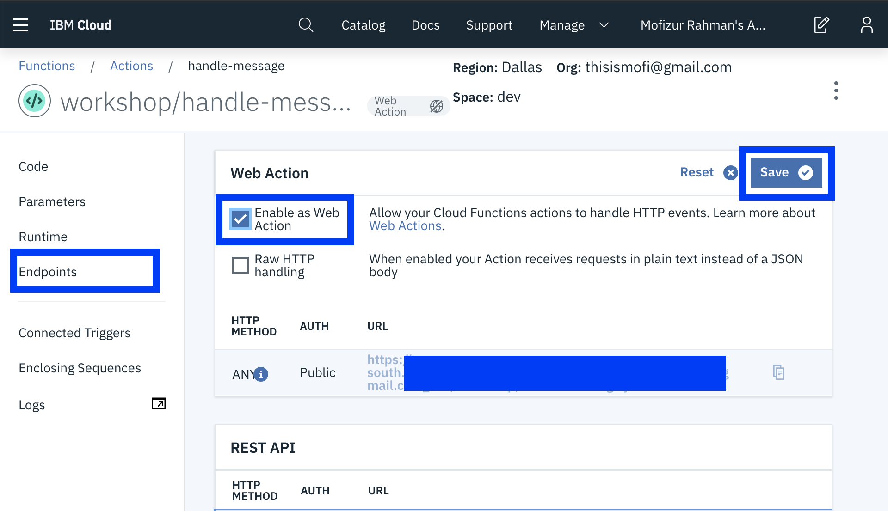
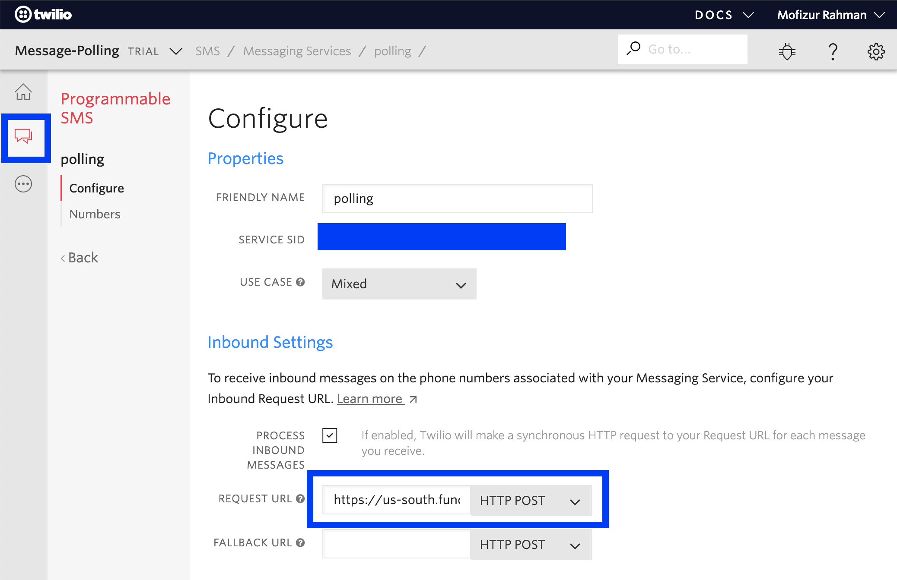

# Twilio Webhook

For handling twilio messages we will convert the handle message function into a web action.

* Go to [https://cloud.ibm.com/openwhisk/actions](https://cloud.ibm.com/openwhisk/actions) 
* Select handle-message action
* Click on Endpoints
* Check Enable as Web Action
* Then Click Save

* Copy the URL then Go to twilio dashboard -&gt; Programmable SMS -&gt; SMS -&gt; Polling \(or your application name\) -&gt; Configure -&gt; Enable Process Inbound Messages
* Paste the URL as the Request URL, but change the end to `.http` from `.json` this tells twilio to accept a HTTP response and not a JSON response. This is crucial because we are making use of `TwiML` to send reply to our user.

* Lets go test our offline capabilities shall we?
* From your phone text the twilio number.
* If you text a `?` it should reply back with some helpful text.
* If you text a `id` of a question. It will reply with the question and options.
* If you text a `id` and a `index` separated by a new line vote will be submitted for that id  for that index.

